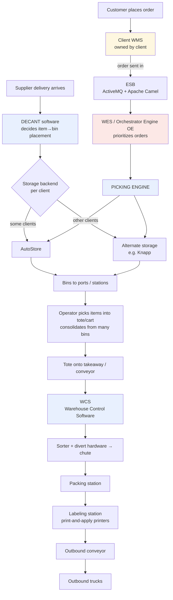
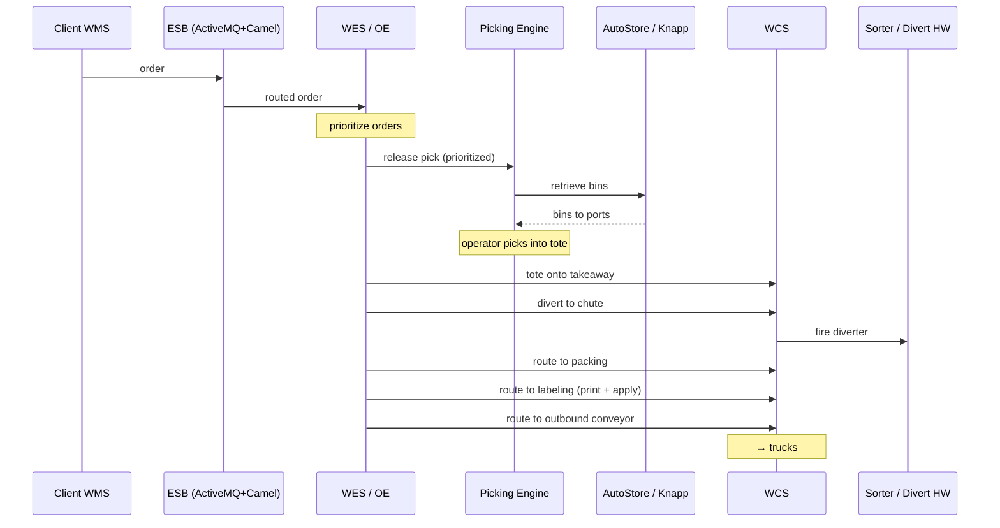
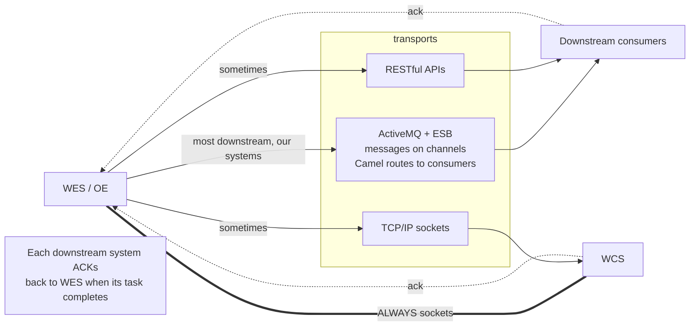
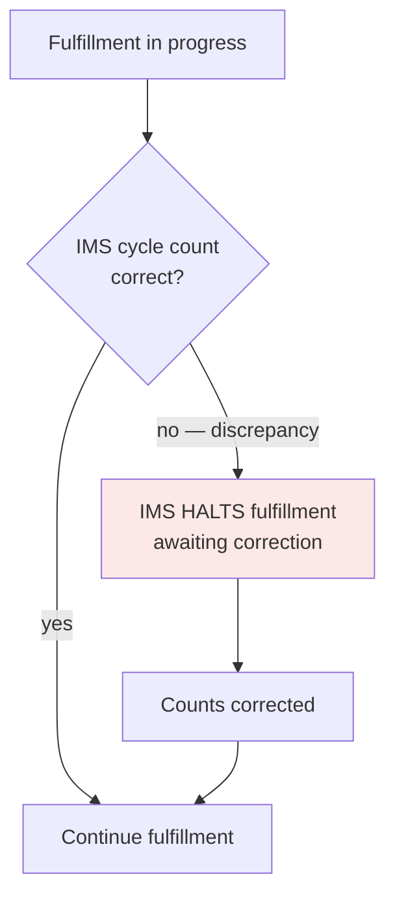
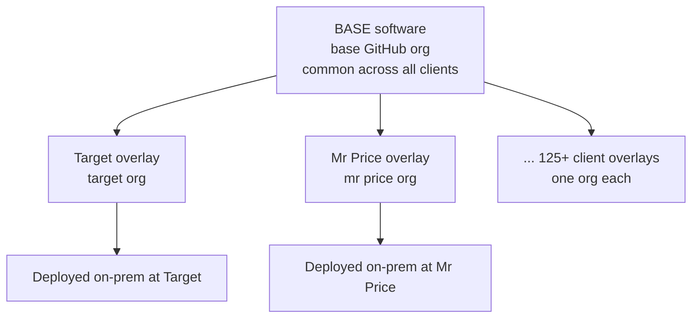
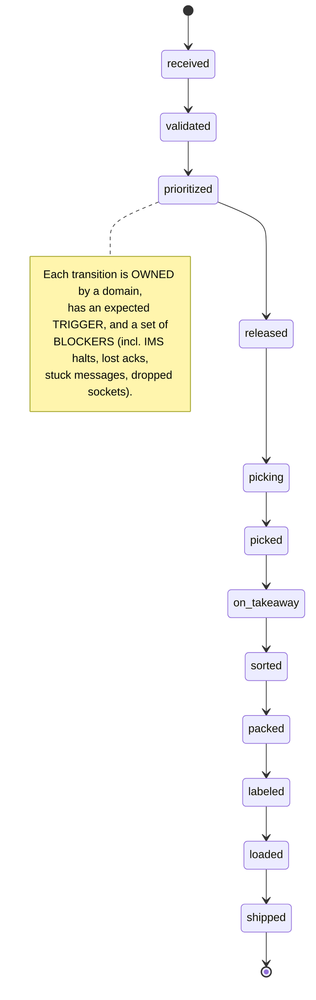
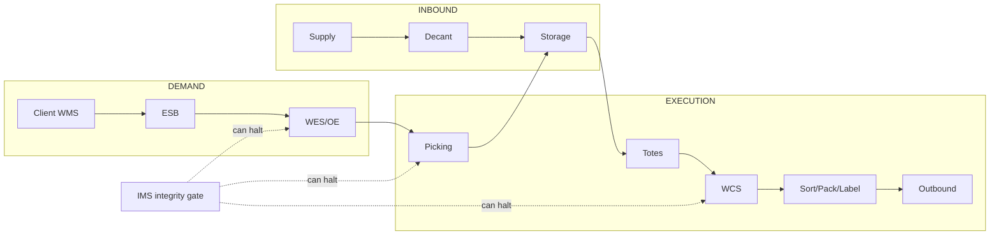
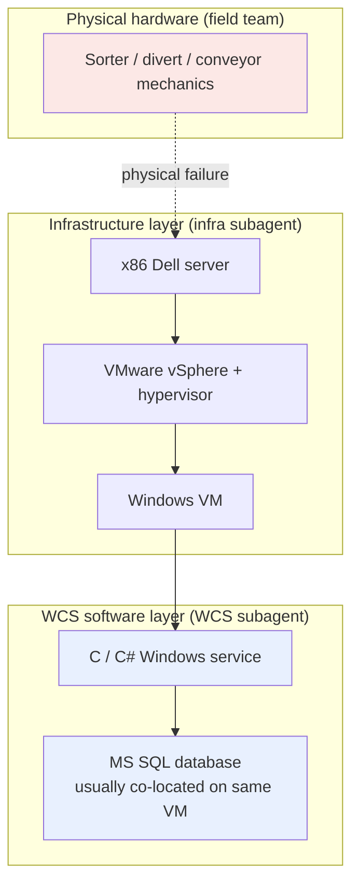

# 1 · Warehouse Operations — Systems & How They Work Together

How a supplier delivery becomes a shipped order, and the software systems (mostly built by our company, a systems integrator for 125+ client warehouses) that make each step possible.

---

## 1.1 The end-to-end flow

> **WMS is always the client's** (shown in yellow). Everything else in the spine is our software. The two storage backends depend on the client.

### Stage-by-stage

| Stage | What happens | Owning software |
|---|---|---|
| Inbound / decant | Supplier items placed into bins | **Decant** |
| Storage | Bins stored, retrieved on demand | **AutoStore** or **alternate (Knapp)** per client |
| Order intake | Customer orders enter from the client's WMS | **WMS (client-owned)** → into our stack |
| Orchestration | Orders prioritized; execution coordinated | **WES / OE** |
| Picking | Storage instructed to bring bins; operators pick into totes | **Picking engine** + storage |
| Control | Totes routed physically across the floor | **WCS** |
| Sortation | Divert to the right chute | **WCS** + sorter/divert hardware |
| Pack & label | Order packed, label printed and applied | **WCS**-directed packing & labeling stations |
| Outbound | Package to truck | **WCS** |

---

## 1.2 WES is the conductor for the whole second half

WES (also called the Orchestrator Engine / OE) decides order **priority**, then keeps instructing WCS at each physical stage. There are several **flavors** of WES depending on the client.

---

## 1.3 Transport layer — how systems talk (this matters for diagnosis)

Communication is **not uniform**. Each transport fails differently and is diagnosed differently.

- **WES → our downstream systems:** mostly **ActiveMQ + ESB**; sometimes **REST**; sometimes **sockets**.
- **WES ⇄ WCS:** **always TCP/IP sockets**.
- **Acknowledgment path:** every system **acks back to WES** when its task completes. A task that completed but whose ack never returned leaves WES thinking work is still pending — a classic, maddening failure mode.

**ESB internals:** built on **ActiveMQ** for transport (messages on channels) with **Apache Camel** layered on top to route messages from channels to the right consumer.

| Transport | Typical failure signature |
|---|---|
| ActiveMQ / ESB | stuck queue, dead consumer, backed-up channel, poison/dead-letter |
| REST | timeout, 500, auth error, retry storm |
| TCP/IP sockets (WCS) | dropped/hung/half-open connection, framing mismatch |
| Ack path | work done but ack lost → WES stuck waiting |

---

## 1.4 IMS — the integrity gate that can stop everything

**IMS (Inventory Management System, ours)** keeps inventory counted correctly via **cycle counting** as orders are fulfilled. If a cycle count is wrong, **IMS halts fulfillment at that point** for correction.

> **Key insight for support:** a stalled order is *not always a failure*. IMS may be **deliberately holding** it because counts didn't reconcile. A naive diagnosis chases a phantom bug; the right move is to check whether IMS flagged a discrepancy.

---

## 1.5 The software is structured as base + per-client customization

- A **base software** plus a **customization per client** built on top, applied across all domains.
- All of it lives in **GitHub**: base in the **base org**, each client in its **own org** (Target org, Mr Price org, …).
- Any real diagnosis reads **base + the relevant client overlay**.

---

## 1.6 The deep truth: it's a state machine of domain entities

Every order, tote, bin, and inventory record is a **domain entity** with a lifecycle: it moves from an **initial state**, through **intermediate states**, to an **end state**.

> **A production incident is, almost by definition, an entity stuck in an intermediate state it should have left** — "order is late" really means "the order entity is stuck in `picking` when it should be `packed`." Entities also **depend on each other** (an order can't advance until its bins arrive), so diagnosis means tracing the dependency web until you find the real blocker.

---

## 1.7 One-page mental model

**Three intertwined layers to hold in mind:** the **flow** (inbound→outbound), the **transport** (ActiveMQ/REST/sockets + ack path), and the **integrity/control** layer (IMS can stop the machine).

---

## 1.8 WCS hardware and software stack

WCS runs on a well-defined on-prem stack. Understanding it is critical for discriminating between software bugs, infrastructure failures, and physical hardware faults.

**The discrimination rule — where the hypervisor boundary sits:**

| Symptom | Owning team |
|---|---|
| Divert / sorter / conveyor mechanics jammed | Field engineer (hardware) — outside our software stack |
| VM down, hypervisor issue, disk/memory exhaustion, vSphere fault | **Infra subagent** |
| Windows service crashed or hung, MS SQL issue, C/C# code bug | **WCS subagent** |

- WCS software is **C and C# code** running as **Windows services**.
- The **MS SQL database** (WCS's only DB type) typically runs on the **same Windows VM** as the service.
- When the WCS subagent exhausts its software-layer hypotheses and the symptom points below the hypervisor, it routes to **infra**. When the root cause is clearly physical mechanics, the orchestrator escalates to a **field engineer**.

> **Key for diagnosis:** check whether the Windows service is alive and MS SQL is reachable before assuming hardware. Most WCS incidents are software-layer; physical hardware failures are relatively rare and have distinct signatures (sensor faults, E-stop events, mechanical alerts in WCS logs).
