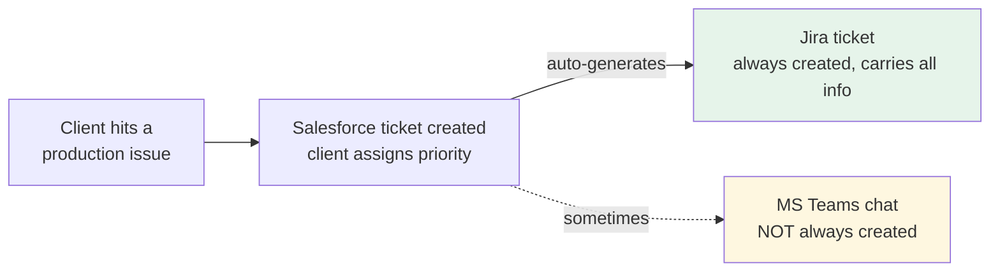
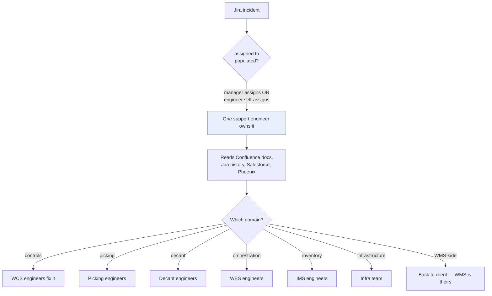
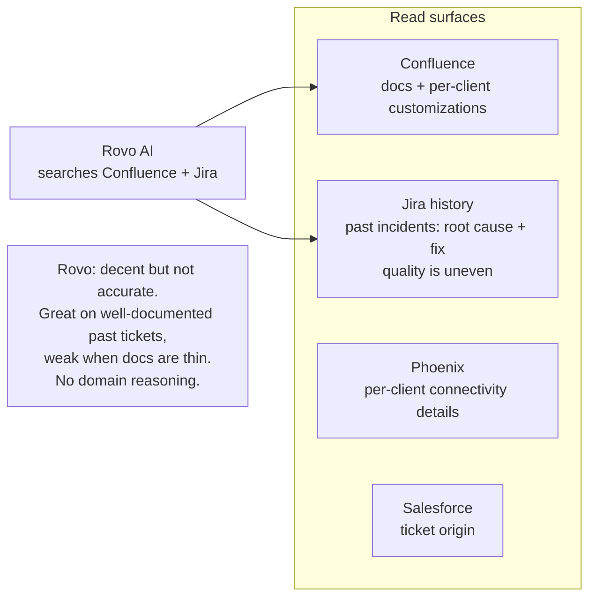
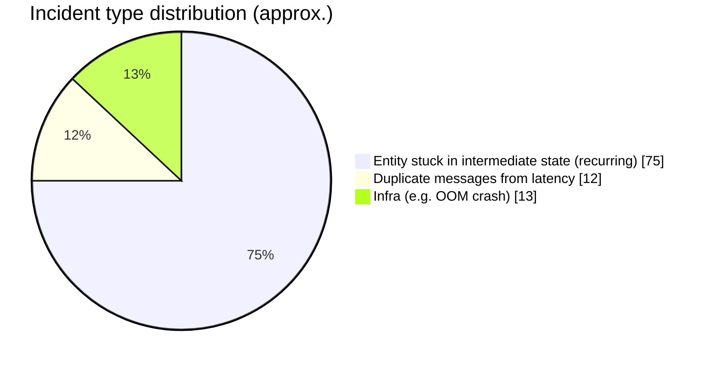
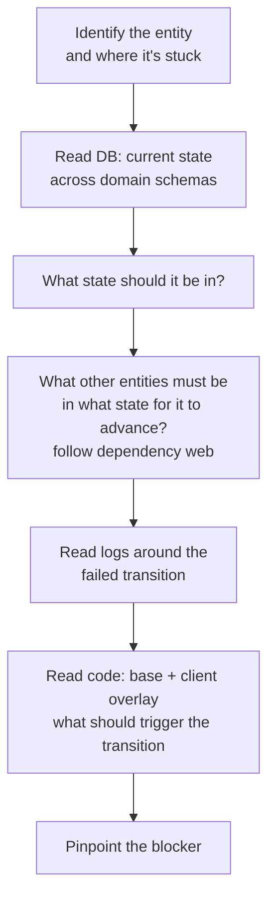
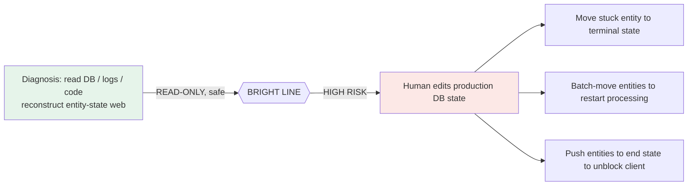
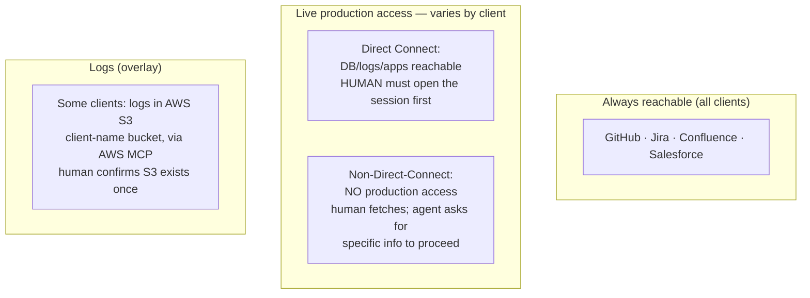
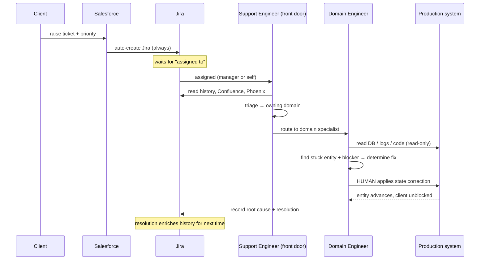

# 2 · Support Process — From Incident Creation to Resolution

How production support works today across 125+ client warehouses: how an incident is raised, triaged, diagnosed, and resolved, and every system, role, and constraint involved.

---

## 2.1 The company's role

We are a **systems integrator**. We run a suite of software (decant, WES, picking, WCS, IMS, ESB) across **125+ client warehouses**, each a base + per-client-customization deployment. **Any client, at any time**, can hit a production issue.

---

## 2.2 How an incident is born

- **Salesforce ticket** is the origin; the client always assigns a **priority**.
- A **Jira ticket is always auto-created** from it, carrying all the provided info → **Jira is the reliable backbone**.
- A **Teams chat is sometimes** auto-created for talking to the client and internal engineers — but inconsistent, so treated as enrichment, not a dependency.

### Jira ticket fields

| Field | Role |
|---|---|
| **Assigned To** | The support engineer who owns the incident. This is the **trigger field** (agent waits for it) and the identity the agent uses to open the Teams DM. |
| **Case Owner** | Irrelevant for agent purposes — ignore. |
| **Priority** | P1 / P2 / P3 / P4 — drives SLA clock and routing urgency. |
| **Created** | Jira timestamp — the SLA clock starts here. Used for baseline measurement and SLA attainment tracking. |
| **Summary** | Free-text incident description. **Treat as optional and incomplete** — quality is uneven; do not assume it alone is sufficient to start diagnosis. |
| **Background** | Free-text context field. **Treat as optional and incomplete** — same caveat as Summary. These fields improve as the system learns and as engineers fill them in more completely over time. |
| **Linked Issues** | Sometimes past similar resolved incidents are linked here. Mine these when present — they are high-quality history signals. |

> **Design implication:** the agent cannot rely on Summary + Background being complete. The agent must proactively fill gaps via human interaction (`/ask`) and by pulling from vector-store history. As incidents are resolved and recorded, the stored evidence and resolution enriches future diagnoses so the system improves over time even when initial ticket quality is low.

### Priority & SLA

| Priority | Meaning | SLA |
|---|---|---|
| **P1** | Highest | **4 hours** |
| **P2** | Second | **8 hours** |
| **P3** | — | **72 hours (3 days)** |
| **P4** | Lowest | **168 hours (7 days)** |

Engineers work tickets in priority order. **On worst days ~10 incidents run concurrently, mostly P1** — the scenario where humans get overwhelmed and SLAs are at risk.

---

## 2.3 The human support workflow today

- **One support engineer** is the front door. Their core job is **triage and routing** — determine which domain owns the issue.
- The issue can live in **any domain**: picking, decant, inventory (IMS), orchestration (WES), controls (WCS), or **infrastructure**.
- **WMS is always the client's** — observable by effect, not owned by us; some issues route back to the client.
- This human pattern *is already* an orchestrator-and-specialists model: the **support engineer = orchestrator**, the **domain engineers = subagents**.

---

## 2.4 Where the knowledge lives

- **Confluence:** software docs and the per-client customizations (sprawling).
- **Jira history:** past incidents with resolution + root cause — but documentation quality is **inconsistent**.
- **Phoenix:** per-client **connectivity details**.
- Today engineers use **Rovo AI** to search Confluence/Jira. It surfaces past incidents and pages but isn't reliable for root cause and has **no model of the warehouse domain** — that's the gap a domain-specialized agent fills.

---

## 2.5 Most incidents are stuck-state, and recurring

- **Most** incidents = an **entity stuck in an intermediate state**, processing stopped, client notices. These are **recurring** — strong history exists.
- **Fewer:** latency causing **duplicate messages**; infrastructure failures like **out-of-memory crashes**.

### The diagnostic method for the dominant case

Engineers inspect three things: **source code** (GitHub base + client org), **machine logs**, and the **database** (entity state). The system is fundamentally a **state machine of domain entities**.

### Database variety across clients

There is no single pre-known schema. Each client has its own databases, and schema details are discovered at runtime during the incident:

| DB type | Where used |
|---|---|
| **Oracle** | Primary — most domains across most clients |
| **Postgres** | Some clients, some domains |
| **MS SQL** | WCS only (always) |

**Discovery approach:** the agent reads the client's GitHub repo (code and config reveal table names, column names, state values) and asks the assigned engineer for anything it cannot determine from code. Physical schema introspection (`information_schema` or DB-equivalent) is used when Direct Connect access is available.

---

## 2.6 How the fix is applied (the safe/risky boundary)

- **Diagnosis** is database-centric and **read-only** — safe, and the bulk of the work.
- **The fix** is direct **state correction in the production DB**: move a stuck entity to terminal, batch-move to restart, or push entities to end-state to unblock the client.
- **Hard rule:** the **human applies the fix**. Writing live production state is the high-risk tier and stays human-owned.

### The canonical fix pattern

The vast majority of fixes are a **targeted DB `UPDATE`**: move the stuck entity's row to a desired terminal (or restart) state. The agent's job is to determine:

1. **Which table and row** — the specific entity record.
2. **Which state value** — the terminal or restart state that unblocks processing.
3. **The exact statement** — a human-executable `UPDATE … SET state = '…' WHERE id = …`, verified reversible and scoped.
4. **The verification step** — what the engineer should observe to confirm the entity advanced (e.g., "order 12345 reaches `shipped` within 2 minutes").

The agent produces this as a structured fix proposal; the human reviews it and runs it. Batch variants (moving many entities at once) follow the same shape with a `WHERE id IN (…)` or range clause.

---

## 2.7 Connectivity tiers (per client) — what support can reach

- **Universal read:** GitHub, Jira, Confluence, Salesforce.
- **Direct Connect clients:** production DB/logs/apps are reachable — but **a human opens the session first**.
- **Non-Direct-Connect clients:** **no** production access; the human retrieves data and the agent must **ask for specific, precise information** to move forward.
- **S3-log clients (few):** application logs sit in an **AWS S3 `{client-name}` bucket**, readable via the **AWS MCP server**, gated by a one-time human confirmation that S3 logs exist.

---

## 2.8 The full lifecycle, incident to resolution

---

## 2.9 Why this is hard (and where time is lost)

- An incident **rarely lives in one system** — "order 47 is late" could be a stuck ActiveMQ message, a WES priority decision, a picking↔storage sync issue, a station backup, an IMS halt, or a WCS misroute. The hard part is **tracing one order across all systems** to find where it stalled.
- **Symptom ≠ cause:** the stall surfaces at one transition but is often caused upstream.
- **Time sinks:** "whose is this?" triage, "have we seen this before?" history hunting, and reaching scattered per-client on-prem evidence — all burning the SLA clock, especially on the 10-concurrent-P1 day.
