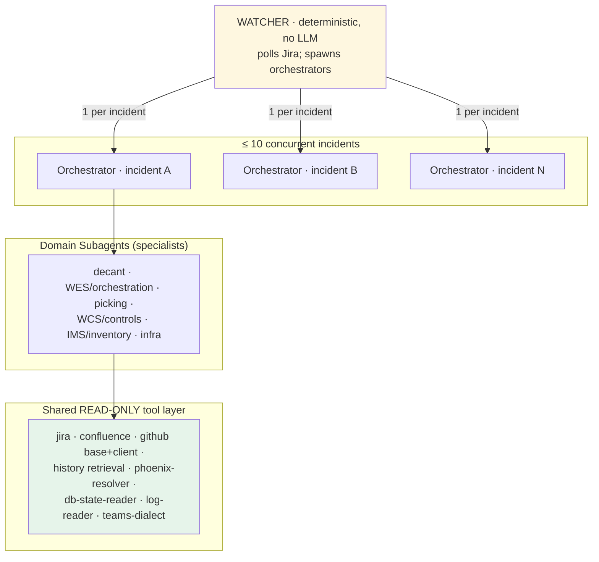
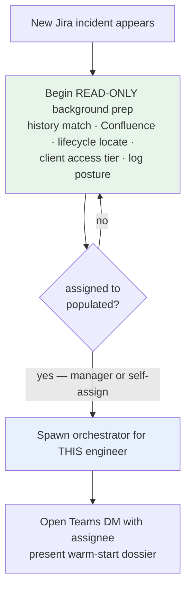
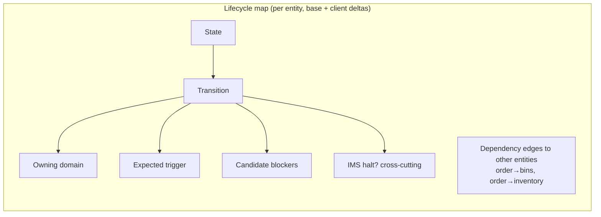
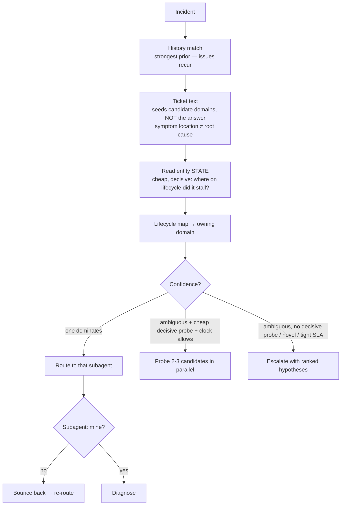
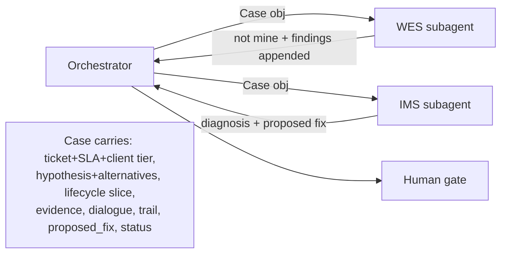
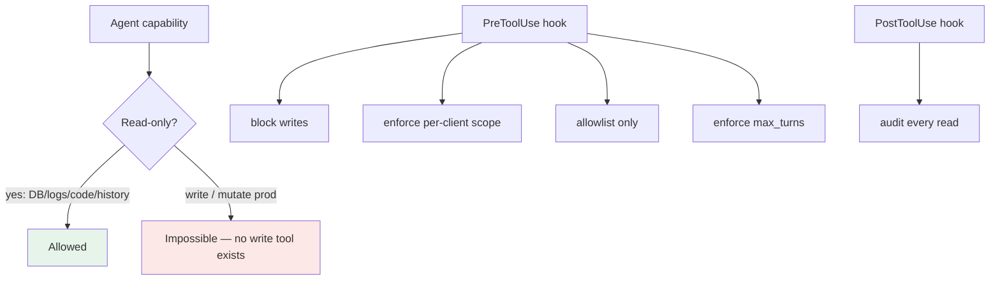
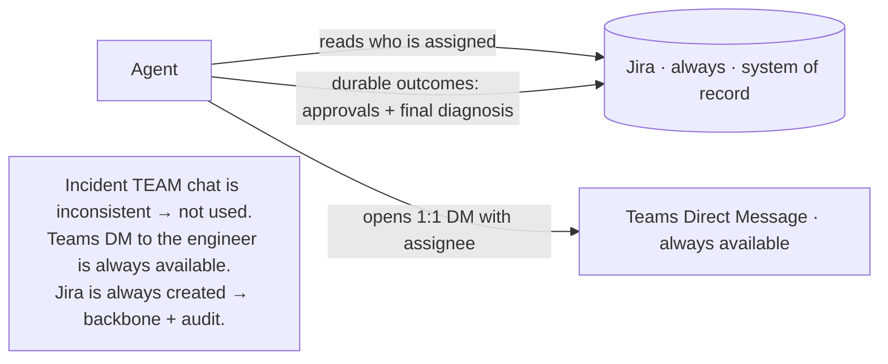
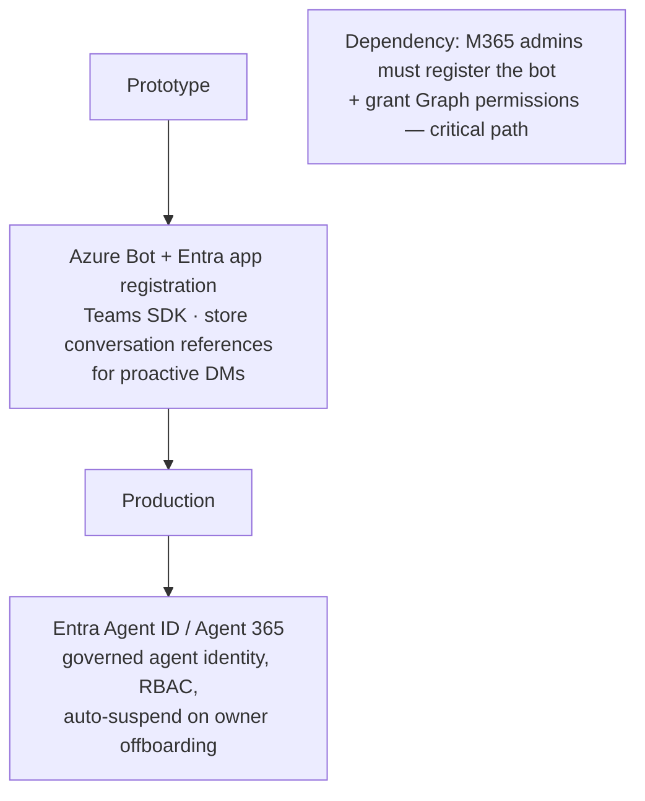
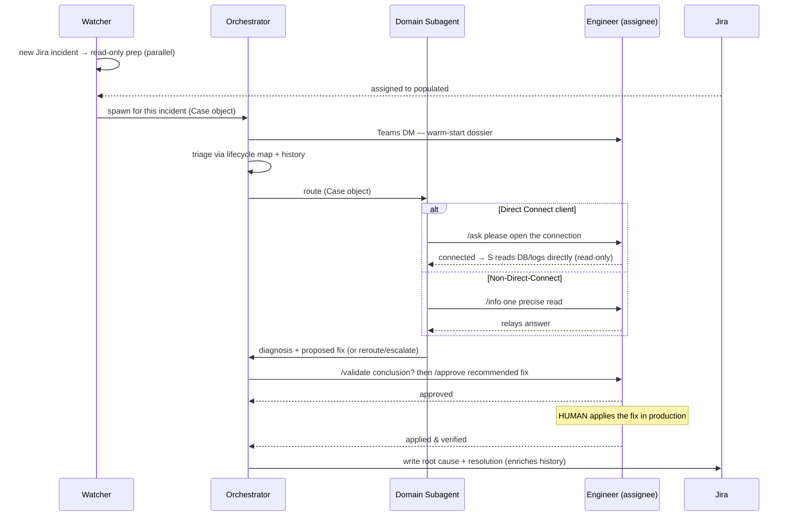

# 3 · Agent Design — Orchestrator, Subagents, Human Guardrails & Interactions

The design of the long-running orchestrator and domain subagents, how work hands off, where humans sit as guardrails, and exactly how agents and humans interact.

**North star:** *Agents read, reason, and recommend. Humans act.* The agent never writes to a client system; it diagnoses through to a **verified, determined fix**, and a human applies it.

---

## 3.1 Topology — one orchestrator design, one instance per incident



- **One orchestrator *design*; one *instance* per active incident** (up to ~10 concurrent). A thin **deterministic Watcher** (not an LLM) polls Jira and spawns them.
- **Orchestrator:** triage + routing + human dialogue + final fix assembly + Jira record. Reasons and routes; does not do deep domain diagnosis itself.
- **Six domain subagents:** mirror the org chart exactly — each owns one domain's deep diagnosis.
- **Shared tool layer:** read-only capabilities every agent uses. **There is no write tool.**

> The human support engineer = the orchestrator. The domain engineers = the subagents. We're encoding the org chart that already exists.

---

## 3.2 Intake contract — watch Jira, wait for the assignee



- Agents **watch only Jira** (Salesforce is upstream; Jira is always created).
- The trigger field is **`assigned to`** (not `case owner`). **No human interaction until it's populated.**
- **But waiting ≠ idle:** while unassigned, agents do **read-only central prep** so the engineer gets a warm start. No Direct Connect session, no human questions, no fix proposals during this phase.
- Track `assigned to` for **reassignment** — follow it to the new engineer, carrying context.

---

## 3.3 The lifecycle-to-domain map — the system's brain

Routing isn't "classify into a domain." It's "**where in the entity's lifecycle did the transition fail?**" — and the owning domain falls out of that.



For each transition the map stores: **owner, trigger, blockers, IMS-halt flag, dependency edges**. Example — `prioritized → released` is **WES**-owned; trigger = WES emits release; blockers = WES backed up / message stuck in ActiveMQ / picking-engine didn't ack / **IMS hold**. Find an order stuck in `prioritized` → the map hands you the domain *and* a ready blocker checklist.

> Built from **code** base+client (transitions/triggers), **Jira history** (real blockers), and Confluence docs. The map encodes **logical** states and transitions — it does not embed physical DB schema details (table names, column names, state string values), because those vary per client and are discovered at runtime. Every resolved incident enriches the blocker-lists and the map compounds over time.

---

## 3.4 How the orchestrator decides the domain



### Escalate-vs-probe rule

| Situation | Action |
|---|---|
| One hypothesis dominates | **Route** |
| Ambiguous, a cheap/safe probe would split hypotheses, clock allows | **Probe** (read-only) |
| Ambiguous, no decisive cheap probe | **Escalate** with ranked hypotheses |
| Novel (no history match) | **Escalate** early — human leads, capture for next time |
| Tight SLA | **Escalate now** with best hypotheses so a human starts with runway |

Escalation is **never a shrug** — it hands over ranked hypotheses, evidence, what was checked, and what it would check next.

---

## 3.5 Handoff & context preservation — the Case object

One **structured Case object** travels with the incident and accumulates at every hop; nothing is re-derived.



Reroute and escalation are first-class; the **trail** means a case can go orchestrator → WES → back → IMS with nothing lost. If a process dies, a new orchestrator **rehydrates from the Case object** and resumes.

---

## 3.6 Guardrails (structural, not just prompts)



| Guardrail | Enforcement |
|---|---|
| Agent never writes to client systems | No write tool exists; all data tools read-only by credential |
| No human-facing action before `assigned to` | Watcher gate; only read-only central prep runs while unassigned |
| Direct Connect needs human to open session | DB/log tool returns "needs connection"; agent must `/ask` first |
| Per-client isolation | Credentials + tool scope bound to `case.client`; cross-client impossible |
| Bounded loops | `max_turns` + SLA-aware termination (diagnose / escalate / reroute / boundary / bounded-give-up) |
| Full audit | Every read logged; approvals mirrored to Jira |

---

## 3.7 Agent ↔ Human interactions (what we settled on)

### Channels: Jira = record, Teams DM = live dialogue



- The agent **reads the assignee from Jira**, then **opens a Teams DM** with that one engineer.
- **Live back-and-forth happens in the DM**; **durable outcomes (approvals, final diagnosis) are written to Jira** as the audit record and to enrich history.

### The dialect (starts minimal, evolves from first principles)

```mermaid
sequenceDiagram
    participant AG as Agent
    participant EN as Engineer

    Note over AG: ONE open request at a time
    AG->>EN: /info current status of order 12345 in orders table<br/>(why: still 'prioritized' ⇒ WES release issue; 'released' ⇒ downstream)
    EN->>AG: still prioritized   ← free-form, no syntax required
    AG->>EN: /info is there an IMS count hold on 12345?
    EN->>AG: no hold
    AG->>EN: /validate root cause = lost ack on release; agree?
    EN->>AG: agree
    AG->>EN: /approve recommend re-driving the release (human applies)
    EN->>AG: approved   → mirrored to Jira
```

**Decisions locked:**

- **Direction-encoded, symmetric protocol:** `/<verb> <context>` from agent → human. The machine bears all structure.
- **Agent → human:** always prefixed; verbs (minimal, growing): `/info`, `/ask`, `/question`, `/clarify`, `/validate`, `/approve`, `/status`. `/approve` is distinct from day one because it carries audit + safety machinery and is mirrored to Jira.
- **Human → agent:** **free-form natural language accepted as-is**; the reply character is optional sugar. The human bears **no** syntax burden.
- **One open request at a time** → reply matching is unambiguous (this is what *lets* the human reply naturally).
- **Everything logged** so real incidents evolve the verb set.

### Agent identity on Teams



- **Prototype:** registered **Azure Bot** (Entra app), proactive DMs via stored conversation references.
- **Production:** migrate to **Entra Agent ID / Agent 365** for governed identity.
- **Hard dependency:** Microsoft 365 admins must register the bot and grant permissions — line this up early.

---

## 3.8 End-to-end agent run (with human gates)



**Two human gates:** a light **validation** of the conclusion, and a hard **approval** of the recommended fix — with the human **always applying** it.
