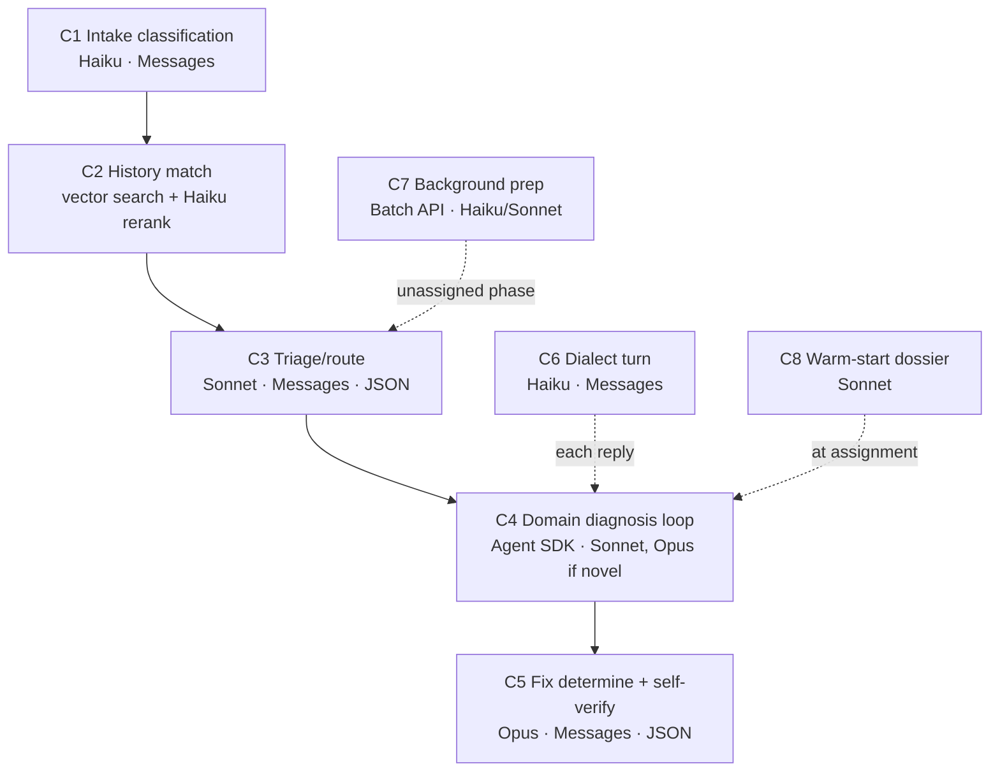
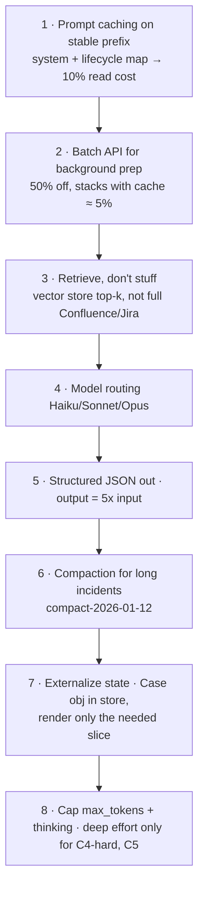
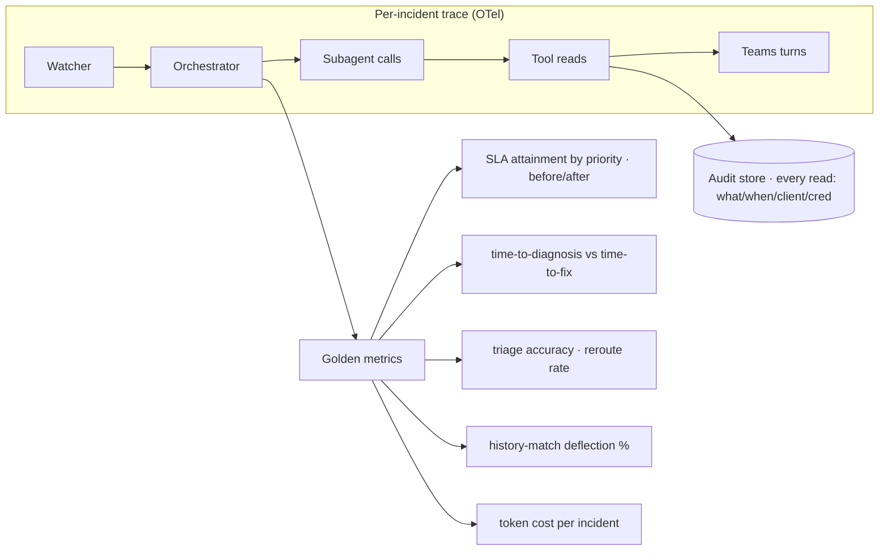
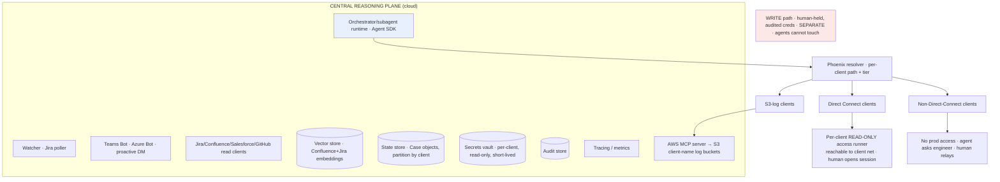
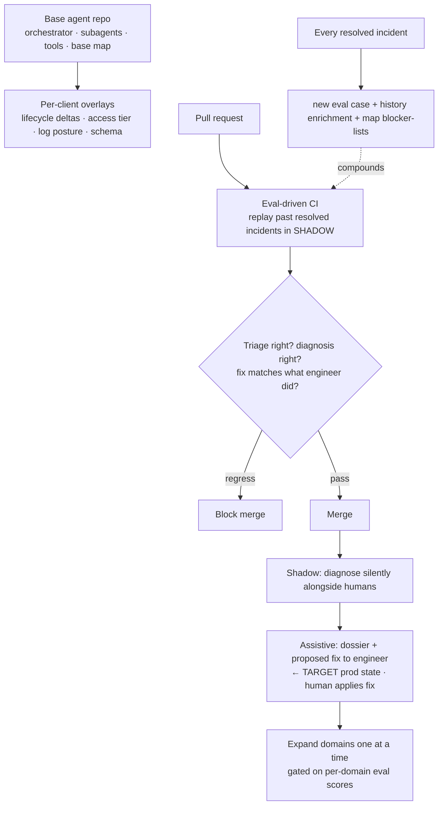
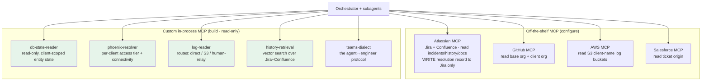
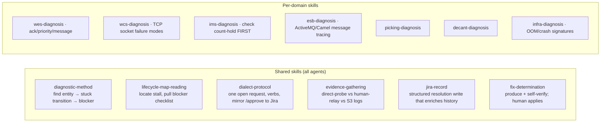
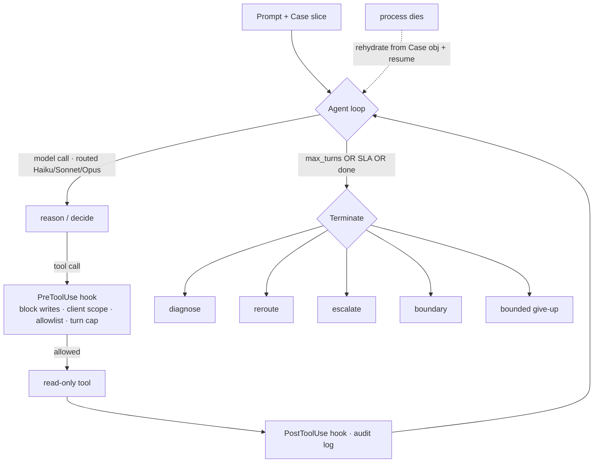

# 4 · Technical Build — Everything We Decided

Implementation blueprint: language, the calls to Anthropic models, request/response shapes, context engineering, DevOps/SRE, infrastructure, and CI/CD.

> Anthropic product facts (models, SDK, pricing levers) verified against Anthropic docs, June 2026. **Re-verify SDK version and model strings at build time** — pin them; Opus 4.8 requires a current SDK.

---

## 4.1 Language

**Python for the agent layer; TypeScript is an equally valid alternative.**

- Claude **Agent SDK** is first-class in both: `pip install claude-agent-sdk` (Python 3.10+) or `npm install @anthropic-ai/claude-agent-sdk` (Node 18+, bundles the native binary).
- **Pick Python** because the surrounding work — client DB drivers, log parsing, Atlassian/AWS SDKs, the DB-state-and-log diagnosis that dominates incidents — leans Python in support/SRE contexts.
- Both expose the same machinery: `query()` agent loop, `ClaudeAgentOptions`, MCP servers, subagents (`AgentDefinition`), hooks, permission modes, structured outputs, session resume, `effort`/thinking knobs.

**Decision:** one language across agents + glue services (Watcher, Teams bot, Jira webhook handler) — Python.

---

## 4.2 Calls to Anthropic models

Two surfaces: **Agent SDK** (`query()`) for tool-loop work; **raw Messages API** for single-shot, no-tool reasoning with tight token control.



| # | Call | Surface | Model |
|---|---|---|---|
| C1 | Intake classification (entity/symptom/candidate domains) | Messages, JSON | **Haiku 4.5** |
| C2 | History match (rank past Jira incidents) | Vector search + Messages rerank | **Haiku 4.5** |
| C3 | Triage / route decision + confidence | Messages, JSON | **Sonnet 4.6** |
| C4 | Domain diagnosis (state-machine loop, DB/log/code tools) | **Agent SDK** | **Sonnet 4.6**, **Opus 4.8** if novel/low-confidence |
| C5 | Fix determination + self-verification | Messages, JSON | **Opus 4.8** |
| C6 | Dialect turn (interpret reply, next question) | Messages | **Haiku 4.5** |
| C7 | Background prep (build dossier, unassigned phase) | **Batch API** (50% off) | Haiku/Sonnet |
| C8 | Warm-start dossier for engineer | Messages, JSON | **Sonnet 4.6** |
| C9 | Memory formulation (resolved incident → structured embedding text) | Messages | **Haiku 4.5** |

**Routing rule:** Haiku = classify/route/parse/memory · Sonnet = diagnose/synthesize · Opus = novel diagnosis + final fix. Model strings: `claude-haiku-4-5`, `claude-sonnet-4-6`, `claude-opus-4-8`. `MODEL_MEMORY = MODEL_HAIKU` (module-level constant in `orchestrator.py`).

**Model facts (verified):** Opus 4.8 `$5/$25` per MTok, 1M context, 128K max output · Sonnet 4.6 `$3/$15`, 1M context, 64K out · Haiku 4.5 `$1/$5`, 200K context, 64K out. Output = 5× input across all.

---

## 4.3 Requests & responses

### Token-structured request (stable prefix cached)

```python
resp = client.messages.create(
    model="claude-sonnet-4-6",
    max_tokens=1500,
    system=[
        {  # role + diagnostic method — identical every call → CACHED (1h)
            "type": "text", "text": SYSTEM_ORCHESTRATOR,
            "cache_control": {"type": "ephemeral", "ttl": "1h"},
        },
        {  # lifecycle-to-domain map (base) — large + stable → CACHED (1h)
            "type": "text", "text": LIFECYCLE_MAP_BASE,
            "cache_control": {"type": "ephemeral", "ttl": "1h"},
        },
    ],
    messages=[{"role": "user", "content": [
        {"type": "text", "text": render_case_for_triage(case)}  # per-incident, NOT cached
    ]}],
)
```

System prompt + lifecycle map are identical across all incidents → cache once, read at ~10% cost on every later call. Only the per-incident Case slice is fresh tokens.

### Structured output contract (compact JSON, not prose)

```jsonc
{
  "entity": {"type": "order", "id": "12345", "current_state": "prioritized"},
  "stuck_transition": "prioritized → released",
  "owning_domain": "WES",
  "root_cause": "Release emitted by WES but never acked by picking engine.",
  "blocker_class": "missing_ack",
  "dependency_findings": [{"entity": "bin", "id": "B-77", "state": "ok"}],
  "proposed_fix": {
    "summary": "Re-drive release for 12345 after confirming picking-engine consumer is alive.",
    "human_steps": ["Verify consumer on channel X up", "Re-emit release", "Confirm → released"],
    "reversible": true,
    "verification": "Order 12345 reaches 'released' and picking starts within 2 min."
  },
  "confidence": 0.86,
  "evidence_refs": ["db:orders#12345@T1", "log:wes-host@14:32"],
  "needs_from_human": null,
  "next_action": "propose_to_human"   // propose_to_human | reroute:IMS | escalate | need_info
}
```

### Agent SDK diagnosis call (read-only + hooks)

```python
options = ClaudeAgentOptions(
    model="claude-sonnet-4-6",
    system_prompt=SYSTEM_WES_SUBAGENT + LIFECYCLE_MAP_BASE,   # cached prefix
    allowed_tools=[                       # READ-ONLY layer only — no write tool exists
        "mcp__support__db_state_read", "mcp__support__log_read",
        "mcp__support__github_read", "mcp__support__history_search",
        "mcp__support__phoenix_resolve",
    ],
    permission_mode="default",            # never acceptEdits — there are no edits
    max_turns=12,
    hooks={
        "PreToolUse": [block_writes, enforce_client_scope, enforce_allowlist],
        "PostToolUse": [audit_log],
    },
)
async for msg in query(prompt=render_case(case), options=options):
    handle(msg)
```

### Dialect over Teams

- Agent → human, **one open request at a time**, prefixed: `/info`, `/ask`, `/validate`, `/approve`, `/status`. `/approve` outcomes mirrored to Jira.
- Human → agent: free-form natural language; reply char optional. A Haiku call (C6) interprets and decides the next turn.

---

## 4.4 Context engineering (minimize tokens)



| Lever | Mechanism | Effect |
|---|---|---|
| Prompt caching | `cache_control` on system + map | cache reads ≈ **10%** of input |
| Batch API | async prep (C7) | **50%** off, stacks with caching → ~**5%** |
| Retrieve not stuff | vector store top-k | 5k vs 500k input tokens |
| Model routing | Haiku/Sonnet/Opus | **60–80%** off naive Opus |
| Structured output | compact JSON | saves the 5× output tokens |
| Compaction | `context_management.edits` | shrinks long incident context |
| Externalized state | Case object in store | carry only the needed slice |
| Cap tokens/thinking | `max_tokens`, `effort` | no runaway output |

> Net: a typical diagnosis carries a few-k fresh tokens against a large **cached** prefix on the cheapest adequate model — often **80–90% cheaper** than naive "everything into Opus."

---

## 4.5 DevOps & SRE

The system supports production, so it must itself be observable and reliable.



- **Tracing:** one trace per incident across Watcher → orchestrator → subagent → tool → Teams. Tie spans to `incident_id`; the Case `trail` is the backbone.
- **Golden metrics = your value proof:** SLA attainment by priority (before vs after) is the headline; plus time-to-diagnosis vs time-to-fix, triage accuracy, reroute rate, history-match deflection, cost/incident.
- **Cost as an SRE metric:** alert on cost-per-incident spikes (a runaway loop shows up here first).
- **Audit log (compliance-grade):** every read + every human approval — non-negotiable across 125 clients even read-only.
- **Graceful failure:** firewall paths time out; tools surface "couldn't reach client X" rather than hang/hallucinate. Orchestrators rehydrate from the Case object and `resume`.
- **On-call for the agent system itself + error budget.** Watch **Phoenix staleness** (wrong connectivity = load-bearing failure).
- **Eval harness** of past incidents as a first-class SRE asset (see CI/CD).

---

## 4.6 Infrastructure — two planes (forced by on-prem reality)



- **Central plane:** agents + universally-reachable reads (GitHub base+client, Jira, Confluence, Salesforce), vector store, Case state store, secrets vault, audit store, tracing. Agent SDK can target Anthropic API directly or Bedrock/Vertex/Azure Foundry if a client/security posture requires a specific cloud.
- **Per-client access:** Direct Connect → **read-only runner** (human opens session); Non-Direct-Connect → **no access**, human relays; S3-log clients → **AWS MCP** against `{client-name}` bucket (one-time, then cached, human confirmation).
- **Phoenix-driven resolver** tells the central plane how to reach each client; cache each client's tier + log posture. Its accuracy is production-critical.
- **Secrets:** per-client, **read-only**, short-lived. The **write path** (human applies fix) uses entirely separate, human-held, audited credentials the agents cannot touch.
- **Teams identity:** Azure Bot (prototype) → Entra Agent ID / Agent 365 (production). Requires M365 admin — critical path.

---

## 4.6.1 Storage requirements

The system reads and recommends, but it has real state that must persist. None of this stores **client production data** — it's the support system's own state. Three durable stores plus eval fixtures:

| Store | Holds | Why it's required | Prototype start |
|---|---|---|---|
| **State store** | Case objects (hypothesis, evidence, dialogue, trail, status), partitioned by client | Incidents span hours; orchestrators are long-running and must **rehydrate-and-resume** after a crash; ~10 concurrent incidents must be retrievable independently | Postgres (or SQLite for a single-node prototype) |
| **Vector store** | Embedded Jira history + Confluence pages | Powers history-matching / deflection — the strongest feature and the thing that beats generic search; without it there is no recurring-issue retrieval | Any lightweight vector DB (pgvector keeps it in one engine) |
| **Audit store** | Every agent read (what / when / client / credential) + every human approval | Compliance-grade accountability across 125 clients' systems, even for read-only access; also builds the trust to widen scope later | Append-only table (Postgres) or log sink |
| **Eval fixtures** | Past resolved incidents (root cause + fix) for the replay harness | The test backbone (§4.7); regression-blocks merges | Files in the repo to start |

**What is NOT stored:** client production data is read **live** and reasoned over in-flight — never warehoused or replicated. The recommended fix is text a human applies; nothing is written to client systems.

**Engineering notes:**
- Partition the state store by `client`; enforce per-client isolation at the storage layer too, not just the tool layer.
- `pgvector` lets the state, audit, and vector needs share one Postgres engine for the prototype — fewer moving parts; split out later if scale demands.
- The state store is the durability behind the "rehydrate from the Case object and `resume`" guarantee in the harness (§4.10) — they're two halves of the same crash-recovery story.
- Retention: audit data is long-lived (compliance); Case objects can age out after resolution + a window; the vector corpus grows continuously as resolved incidents enrich it.
- **Vector store schema (decided):** HNSW index (`CREATE INDEX ... USING hnsw (embedding vector_cosine_ops) WITH (m = 16, ef_construction = 64)`) — `m=16, ef_construction=64` are the standard starting defaults for 1024-dim embeddings (Voyage AI voyage-3): good recall, manageable memory. `UNIQUE(jira_id)` constraint for idempotent upsert; re-resolving the same ticket overwrites the row, not duplicates. IVFFlat is deprecated; use HNSW. Schema column: `vector(1024)`.
- **Embedding model (decided):** Voyage AI `voyage-3` (1024 dims, $0.06/1M tokens). Anthropic-recommended for Claude-based systems; strong on technical text; cheapest quality option. `embed_fn` is injected as an async callable into `PgvectorStoreAdapter`; `None` → ILIKE fallback (PoC mode). See `docs/vector-databases.md` for full rationale and cost model.
- **Agentic RAG write-back:** on resolution, the orchestrator calls C9 (Haiku) to produce a structured four-line memory block (`**Context / Root Cause / Resolution / Watch Out For**`) then upserts it into pgvector via `VectorStoreAdapter.write()`. Non-fatal — vector failure logs a warning but never aborts the Jira resolution path. When `embed_fn=None`, embedding is NULL and `history_search` falls back to ILIKE.

---

## 4.7 CI/CD — mirror your product, exploit your history



- **Repo = base + per-client overlays**, mirroring your own software's GitHub model — the team's mental model transfers directly.
- **Eval-driven CI (key idea):** replay a suite of **past resolved incidents** (known root cause + fix) in **shadow** on every PR; score triage accuracy, diagnosis correctness, and fix-match. Block merges that regress. This is the test layer for non-deterministic agents.
- **Versioned prompts + lifecycle map:** review a map change like a schema migration — it shifts routing for many incidents.
- **Staged rollout:** Shadow → **Assistive** (the production target given "human always applies the fix") → expand domains, gated on eval scores.
- **Environments:** dev (replay suite + synthetic Jira), staging (sandbox client), prod (assistive). **CI never touches real client production** — eval against recorded incidents + sandboxes.
- **Compounding loop:** every resolved incident becomes a new eval case and enriches history + the map's blocker-lists — accuracy grows with every ticket.

### As-built (Prompt 4)

**Entry point:** `python -m evals [--domain WES]` from repo root. Exit 0 = pass; exit 1 = regression.

**Canonical fixture schema** (`evals/fixtures/base/*.yaml`):
```yaml
fixture_id: str                        # unique slug
grounding: "[SYNTHETIC]" | "[JIRA:WH-XXXX anonymized]"
input:
  jira_ticket_id, client, priority, description,
  entity_type (order|tote), entity_id, entity_current_state
ground_truth:
  owning_domain, stuck_transition ("state → state"),
  root_cause, blocker_class, fix_applied, fix_sql (nullable)
scoring:
  triage_correct_if:    {owning_domain}
  diagnosis_correct_if: {stuck_transition, blocker_class}
  fix_match_if:         {proposed_fix_must_mention: [keywords]}  # fuzzy
mocked_tool_responses:   # optional — enables diagnosis eval
  db_state_read / log_read / history_search / github_read / phoenix_resolve
```

**Scoring implementation in `evals/harness.py`:**
- `triage_accuracy` — live now: `load_lifecycle_map(entity_type)` + `find_transition(current_state)` → compare predicted `owning_domain` to fixture. No LLM required.
- `diagnosis_correct` + `fix_match` — scaffolded, activate in Prompt 7 when `subagent.diagnose()` is implemented. Currently `None` (skipped).

**Fixture-backed adapters** (`evals/adapters.py`): `FixtureDbAdapter`, `FixtureLogAdapter`, `FixtureVectorAdapter`, `FixtureGithubAdapter`, `FixturePhoenixAdapter` implement the ABCs from `tools/mcp_server.py`. `build_fixture_adapters(fixture)` selects the right adapter per fixture or falls back to Stub*. Will be wired into the MCP server in Prompt 7.

### As-built (Prompt 5)

**New / updated files:**

| File | Status | What it does |
|---|---|---|
| `support_orchestration/glue/jira.py` | updated | `JiraClient` ABC + `StubJiraClient` (mutable, test-friendly) + `AtlassianJiraClient` (wraps `atlassian-python-api` in executor threads). `write_resolution()` still TODO(P8). |
| `support_orchestration/storage/state_store.py` | **new** | `CaseStore` — SQLite upsert store for Case objects. Postgres-compatible schema. `save_case()`, `load_case()`, `load_case_by_jira_id()`, `get_active_jira_ids()`. Thread-safe. |
| `support_orchestration/watcher/intake.py` | updated | `case_from_jira()` with robust `_parse_jira_datetime()` (handles all Atlassian ISO-8601 variants), `description` field populated from `summary + background`, client fallback to ticket-ID prefix. |
| `support_orchestration/watcher/background_prep.py` | **new** | `BackgroundPrepRunner` — C7 background prep using Batch API. Three steps in parallel: (1) `phoenix_resolve` for connectivity tier + log posture, (2) Haiku via **Batch API** to classify entity type/id/state from ticket text, (3) `history_search` for prior similar incidents. Each step is isolated — one failure does not abort the others. Results written into the Case object; persisted via `CaseStore`. `anthropic_client=None` skips LLM steps (used in tests). |
| `support_orchestration/watcher/jira_poller.py` | updated | Full `JiraPoller` poll loop. `_seen_jira_ids: set[str]` tracks all incidents seen (separate from task dicts so incidents without a prep runner are still tracked). State machine: new-unassigned → background prep; new-assigned → orchestrator directly; seen-unassigned + assignee fires → cancel prep + spawn orchestrator; orchestrator-running + new assignee → reassignment in Case + trail entry. Enforces `MAX_CONCURRENT_ORCHESTRATORS` (10) cap; reaps completed tasks each cycle. |
| `support_orchestration/models/case.py` | updated | Added `description: str = ""` field — carries raw Jira `summary + background` text; used by `BackgroundPrepRunner` to build the entity-classification prompt. |

**Key design choices locked in:**
- `_seen_jira_ids` (not `_background_tasks`) is the canonical "have we seen this incident?" test. Background tasks are optional (no prep runner → no task, but incident is still tracked).
- `CaseStore.save_case()` is an upsert — calling it twice with the same `case_id` updates. Safe for concurrent read-modify-write from prep runner + poller.
- `BackgroundPrepRunner` uses `asyncio.gather` with per-step error isolation (`_safe()` wrapper). A phoenix timeout does not block entity classification.
- Batch API is used for entity classification (C7); polling interval is 30 s, max 60 polls (30 min). If the batch times out, prep completes with partial results — the orchestrator fills gaps via C1/C8.

**Tests added (37 new, 93 total):**
- `tests/storage/test_state_store.py` — 13 tests (CRUD, round-trip fidelity, active-IDs query, multi-client isolation)
- `tests/watcher/test_intake.py` — 12 tests (datetime parsing, field mapping, SLA computation, fallbacks)
- `tests/watcher/test_jira_poller.py` — 9 tests (all poll-loop state transitions, cap, idempotence)

### As-built (Prompt 6)

**New / updated files:**

| File | Status | What it does |
|---|---|---|
| `support_orchestration/orchestrator/prompts.py` | **new** | `SYSTEM_ORCHESTRATOR` (C3 system prompt, prompt-cached), `C1_SYSTEM` (entity classify), `C8_SYSTEM` (dossier). `render_lifecycle_map_text()` (map → cacheable text), `render_case_for_triage()` (per-incident user message), `render_warm_start_dossier()` (template fallback for offline/test). |
| `support_orchestration/orchestrator/triage.py` | updated | Full triage pipeline: `TriageResult` dataclass, `_delta_merge()` (client overlay deep-merge), `run_triage()` (SLA-tight guard → LLM or deterministic), `_deterministic_triage()` (map-only, no LLM — used in tests), `_llm_triage()` (C1 Haiku classify + C3 Sonnet route with prompt caching), `_parse_triage_json()` (robust JSON extract + fallback to escalate). |
| `support_orchestration/orchestrator/orchestrator.py` | **full impl** | `Orchestrator` class fully implemented. Constructor accepts injectable `dialect`, `anthropic_client`, `state_store`, `subagent_factory` for testability. `run()` → `_send_warm_start_dossier()` (C8 or template) → `_triage()` (C1+C3, persists checkpoint) → `_route_and_diagnose()` (escalate-vs-route loop, max 3 reroutes, reroute guard) → `_validate_and_approve()` (/validate + /approve human gates) → `_write_resolution()` (stub; P8 adds Jira write). `_escalate()` sends /status info + persists. |
| `support_orchestration/glue/teams.py` | updated | Added `DialectManager.send_info()` — fire-and-forget `/status` for the warm-start dossier (does not set `open_request`; does not block subsequent requests). |
| `support_orchestration/models/case.py` | **bugfix** | `sla_seconds_remaining()` now uses `datetime.now(timezone.utc)` instead of deprecated `datetime.utcnow()` — fixes `TypeError` when `sla_deadline` is timezone-aware. |

**Key design choices locked in:**
- `Orchestrator` is dependency-injected throughout: `anthropic_client=None` → deterministic triage (test/offline mode). `subagent_factory` injectable so tests can swap in `_SubagentStub` returning any pre-set `Diagnosis`.
- `run_triage()` has three modes: (1) SLA-tight override → always escalate; (2) no Anthropic client → `_deterministic_triage()` (map lookup); (3) client present → C1 Haiku + C3 Sonnet with prompt-cached system + map blocks.
- Reroute guard (`case.reroute_guard: set[str]`) prevents infinite domain cycling. Guard checked before every subagent dispatch; violation → immediate escalate.
- `_is_rejection()` uses a compiled regex (`^(no|nope|disagree|wrong|incorrect)\b`) for word-boundary-correct detection. Full C6 Haiku reply parsing deferred to Prompt 7.
- `/status` messages (dossier, escalation) use `send_info()` and never set `open_request` — they don't block `/validate` or `/approve`.
- Prompt 8 will add the `write_resolution()` Jira call. `_write_resolution()` currently sets `case.status = CaseStatus.resolved` and persists.

**Tests added (36 new, 129 total):**
- `tests/orchestrator/test_orchestrator.py` — 36 tests: deterministic triage (4), `run_triage` async (3), JSON parsing (5), rejection heuristic (3), `_triage()` unit (4), `_route_and_diagnose()` (8), full `run()` (7), prompt renderers (3).

### As-built (Prompt 8)

**New / updated files:**

| File | Status | What it does |
|---|---|---|
| `support_orchestration/glue/jira.py` | updated | `JiraClient` ABC gains `write_resolution(ticket_id, diagnosis_summary, fix_summary)` abstract method. `StubJiraClient` captures calls in `self.written_resolutions` list. `AtlassianJiraClient` implements: (1) adds comment with diagnosis + fix; (2) attempts resolve transition (best-effort — logs warning, doesn't fail). Module-level `write_resolution(case, ..., jira_client=)` convenience wrapper. |
| `support_orchestration/orchestrator/orchestrator.py` | updated | `Orchestrator.__init__` gains `jira_client: JiraClient | None = None`. `_write_resolution()` now builds `diagnosis_summary` + `fix_summary` from `case` and calls `glue.jira.write_resolution(...)` when `jira_client` is injected. Skips gracefully when client is absent. |
| `support_orchestration/tools/adapters/__init__.py` | **new** | Package for production adapters. |
| `support_orchestration/tools/adapters/db_adapters.py` | **new** | `OracleDbAdapter` (oracledb, thin mode), `PostgresDbAdapter` (asyncpg pool), `MsSqlDbAdapter` (pyodbc). All enforce `client_id` scope. All use `_named_to_positional` / `_named_to_qmark` to convert `:name` SQL params to native format. `introspect_schema()` queries `all_tab_columns` (Oracle), `information_schema.columns` (Postgres/MS SQL). |
| `support_orchestration/tools/adapters/vector_adapter.py` | **new** | `PgvectorStoreAdapter` (asyncpg + pgvector). `embed_fn=None` → full-text ILIKE fallback; `embed_fn=async fn` → vector cosine similarity (`<=>` operator). Lazy asyncpg import in `_get_pool()`. |
| `support_orchestration/tools/adapters/log_adapters.py` | **new** | `SshLogAdapter` for Direct Connect clients. SSHs to per-client access runner via paramiko; runs `grep` with shell-quoted args. `read_s3` raises `NotImplementedError` (AWS MCP handles that). |
| `support_orchestration/tools/adapters/phoenix_adapter.py` | **new** | `HttpPhoenixAdapter`: HTTP GET to `{base_url}/api/v1/clients/{client_id}`, normalises response, caches with configurable TTL. Defaults to `human_relay` on any error (safe fallback). |
| `support_orchestration/tools/adapters/github_adapter.py` | **new** | `GithubApiAdapter`: GitHub REST API v3, decodes base64 file content, raises typed errors (FileNotFoundError, PermissionError). `build_from_env()` factory. |
| `support_orchestration/tools/adapters/factory.py` | **new** | `build_adapters_from_env()` — builds all configured adapters from env vars; falls back to None (caller gets stub) when vars absent. `build_mcp_server_from_env()` convenience. |
| `support_orchestration/glue/bot.py` | **new** | `BotFrameworkTransport` implementing `TeamsTransport` ABC. OAuth2 client_credentials token cache. `open_direct_message(teams_user_id)` → POSTs to Bot Connector `/v3/conversations`. `send_message()` → sends activity to conversation. `receive_message()` → blocks on `asyncio.Queue` until `on_activity()` delivers a reply (called by webhook handler). `aiohttp` imported at module level with try/except (None if missing). |
| `support_orchestration/config/base.py` | updated | Added `PHOENIX_BASE_URL`, `PHOENIX_API_TOKEN`, `VECTOR_STORE_DSN`, `TEAMS_*`, `ATLASSIAN_USER/PROJECT_KEY`, `GITHUB_CLIENT_ORG_PREFIX`, `AWS_REGION`. |
| `pyproject.toml` | updated | Added `aiohttp`, `oracledb`, `asyncpg`, `pyodbc`, `paramiko` dependencies. |

**Key design choices locked in:**
- `write_resolution` is on the `JiraClient` ABC — testable via `StubJiraClient.written_resolutions`; the `Orchestrator` never imports the real Atlassian client directly.
- Resolve transition is **best-effort**: the Jira comment is the load-bearing write; a failed or missing transition is logged but never raises. Jira workflows vary by instance.
- `BotFrameworkTransport.receive_message()` uses an `asyncio.Queue` per `conversation_id`. The webhook handler calls `on_activity()` (thread-safe via `loop.call_soon_threadsafe`) to deliver replies.
- All production adapters use lazy package imports (`_get_pool()`, not `__init__`) so the adapter class loads and can be tested without the optional package installed.
- Client scope is enforced at the adapter layer (`_check_scope`) — belt-and-suspenders alongside the PreToolUse hook.

**Tests added (58 new, 218 total):**
- `tests/glue/test_jira_write.py` (NEW) — 10 tests: stub capture, accumulate, async, module-level delegation, Atlassian comment, transition, transition-failure, no-match-transition, ABC compliance.
- `tests/glue/test_bot.py` (NEW) — 10 tests: ABC compliance, token success/cache, send_message posts to connector, receive/on_activity round-trip, timeout, env build.
- `tests/tools/test_db_adapters.py` (NEW) — 12 tests: param conversion (named→$n, named→?), import errors for oracledb/asyncpg/pyodbc, scope enforcement for all 3 adapters.
- `tests/tools/test_vector_adapter.py` (NEW) — 5 tests: import error, fulltext search SQL, filters, embed_fn vector path, no-filter.
- `tests/tools/test_log_adapters.py` (NEW) — 5 tests: paramiko error, missing credential, grep command safety, read_direct, S3 raises.
- `tests/tools/test_phoenix_adapter.py` (NEW) — 6 tests: ABC compliance, resolve success, cache, error→human_relay, unknown tier normalisation, invalidate.
- `tests/tools/test_github_adapter.py` (NEW) — 7 tests: ABC compliance, read_file success, 404, 403, auth header, build_from_env (error+success).
- `tests/orchestrator/test_orchestrator_p8.py` (NEW) — 5 tests: write_resolution called after approve, skipped without client, includes fix SQL, not called on escalation, jira_client kwarg accepted.

---

### As-built (Prompt 7)

**New / updated files:**

| File | Status | What it does |
|---|---|---|
| `support_orchestration/subagents/prompts.py` | **new** | `DIAGNOSIS_TOOL_SCHEMAS` (5 tools as raw Messages API defs, `mcp__support__*` names). `C4_SYSTEM_BASE` (diagnostic method + output format contract). `WES_DOMAIN_CONTEXT` (failure modes: lost_ack, consumer_down, priority_queue_stall, ims_hold, picking_engine_busy). `build_wes_system_prompt()`, `render_case_for_diagnosis()`, `parse_diagnosis_json()` (`<diagnosis>…</diagnosis>` → Pydantic), `bounded_give_up()`. |
| `support_orchestration/subagents/base.py` | **full impl** | `BaseSubagent.__init__` gains `anthropic_client`, `dialect`, `audit_store`, `adapters`. `diagnose()` implemented: raw Messages API tool loop (≤ MAX_TURNS=12), PreToolUse hooks enforced in Python per turn, relay-sentinel handling (`relay_required` → `/ask` dialect if injected), bounded-give-up on exhaustion. `_call_tool_with_hooks()`, `_dispatch_tool()` (fan-out to 5 tool functions with adapter injection), `_handle_relay()`. `get_subagent()` now passes all kwargs through. |
| `support_orchestration/glue/teams.py` | updated | Added `c6_interpret_reply(reply, context, anthropic_client) -> str` (C6 — Haiku classifies engineer reply as affirm \| reject \| provide_info \| question \| other; regex fallback on exception). Added `_C6_CLASSIFY_PROMPT`. |
| `support_orchestration/orchestrator/orchestrator.py` | updated | Default `subagent_factory` closure now wires `anthropic_client` + `dialect` into every subagent. `_validate_and_approve()` calls C6 Haiku when client present; regex `_is_rejection()` fallback when offline. `need_info` comment clarified: relay handled inside subagent; orchestrator-level need_info → escalate. |
| `evals/harness.py` | updated | `run_eval()` and `run_all_evals()` accept `anthropic_client=` kwarg. Fixture adapters passed to `get_subagent(adapters=...)`. Without client, `diagnose()` raises `NotImplementedError` → `diagnosis_skipped=True` (backward compatible). |
| `evals/cli.py` | updated | Diagnosis-skipped message updated: "pass anthropic_client to run_all_evals()". |
| `skills/diagnostic-method/SKILL.md` | **authored** | Universal 8-step method: history → connectivity → entity state → map → blockers → root cause → fix → self-verify. Termination criteria. |
| `skills/dialect-protocol/SKILL.md` | **authored** | Verb table, one-open-request rule, /ask pattern for human-relay, /validate-before-/approve gate, /approve audit rules. |
| `skills/wes-diagnosis/SKILL.md` | **authored** | WES failure modes, IMS cross-cut rule (check FIRST), evidence-gathering order, fix patterns per blocker_class. |

**Key design choices locked in:**
- **Raw Messages API for C4 (not Agent SDK `query()`)**: `ClaudeAgentOptions` does not expose inline Python hook callbacks or model selection (it wraps the CLI binary). Raw API gives full hook control, model routing, and testability without a subprocess. Agent SDK remains the long-term target.
- **`diagnose()` raises NotImplementedError when `anthropic_client=None`**: backward compat with all existing orchestrator tests that use `_SubagentStub` factories. No test breakage.
- **Relay sentinel inside subagent loop**: when `log_read` returns `{"relay_required": True}` and dialect is injected, subagent sends `/ask` inline and uses engineer reply as tool result. If no dialect, result includes informational note; agent can return `need_info`.
- **`get_subagent()` kwargs are additive**: all existing tests that call `get_subagent(domain, case)` still work; new kwargs are keyword-only with defaults of None.
- **Eval harness**: `anthropic_client=None` keeps all 4 fixtures at triage-pass/diagnosis-skip (100% triage, 0% diagnosis — same as before). Diagnosis scoring activates when a real client is passed.
- **C6 fallback**: `c6_interpret_reply()` falls back to the existing `_is_rejection()` regex logic when the Haiku call fails — no regression in offline/test mode.

**Tests added (31 new, 160 total):**
- `tests/subagents/test_wes_subagent.py` (NEW) — 16 tests: no-client raises, end-turn diagnosis parsing, tool loop + diagnosis, relay via dialect, relay without dialect, pre-hook blocks write/cross-client/allowlist violation, max-turns bounded give-up, malformed JSON give-up, reroute next_action, fixture adapters, dispatch unknown tool, bounded_give_up shape, parse_diagnosis_json with tags, parse invalid returns None, WES system prompt content, get_subagent kwargs.
- `tests/glue/test_dialect_c6.py` (NEW) — 7 tests: reject, affirm, provide_info, unknown→other, multiword response, exception fallback reject, exception fallback affirm.
- `tests/orchestrator/test_orchestrator_p7.py` (NEW) — 6 tests: C6 affirm passes validation, C6 reject escalates, no-client regex fallback, default factory wires client, default factory wires dialect, need_info escalates with question.
- `tests/glue/__init__.py` (NEW) — package marker.

---

### As-built (Prompt 9)

**New / updated files:**

| File | Status | What it does |
|---|---|---|
| `support_orchestration/subagents/prompts.py` | updated | 8 new domain context blocks (`ESB_DOMAIN_CONTEXT`, `GTP_PICKING_DOMAIN_CONTEXT`, `GTP_DECANT_DOMAIN_CONTEXT`, `IMS_DOMAIN_CONTEXT`, `ASRS_DOMAIN_CONTEXT`, `LPN_DOMAIN_CONTEXT`, `WCS_DOMAIN_CONTEXT`, `INFRA_DOMAIN_CONTEXT`) each 4,600–5,800 chars with failure modes, lifecycle ownership, diagnostic checklist, and fix patterns. Corresponding `build_*_system_prompt()` builders. |
| `support_orchestration/subagents/base.py` | updated | 8 new domain subagent classes (GTPPickingSubagent, GTPDecantSubagent, IMSSubagent, ASRSSubagent, LPNSubagent, WCSSubagent, InfraSubagent, ESBSubagent) each delegating `system_prompt` to the per-domain builder. `DOMAIN_SUBAGENT_MAP` and `DOMAIN_PRIORITY_ORDER` extended to all 9 domains. |
| `evals/fixtures/base/*.yaml` | **new (14 files)** | 14 new fixtures spanning all 8 remaining domains (see fixture list in CLAUDE.md). All triage-pass at 100%. Reroute-target domains (IMS, ASRS, LPN, infra, GTP_DECANT) use a parent-domain entity state so lifecycle-map triage routes correctly; diagnosis reroute is exercised when `--diagnose` is run. |
| `skills/*-diagnosis/SKILL.md` | **authored (9 files)** | All 9 per-domain diagnosis skills completed: `esb-`, `gtp-picking-`, `gtp-decant-`, `ims-` (count-hold check FIRST), `asrs-`, `lpn-`, `wcs-`, `infra-`, plus the existing `wes-`. Also added: `evidence-gathering`, `fix-determination`, `jira-record`, `lifecycle-map-reading`. |

**Key design choices locked in:**
- **WES pattern reused verbatim**: each new subagent class is ~5 lines (DOMAIN + system_prompt property). All diagnosis logic lives in `BaseSubagent.diagnose()` — no per-domain overrides.
- **System prompt structure fixed**: `C4_SYSTEM_BASE` (shared) + `{DOMAIN}_DOMAIN_CONTEXT` (per-domain) + `"Client for this incident: {client}"`. Domain context includes the cross-cut rule for each domain (e.g., IMS: check count-hold FIRST; WCS: check socket before service; ASRS: check ASRS API reachability before robot faults).
- **Reroute-target domains not in lifecycle map**: IMS, ASRS, LPN, infra, GTP_DECANT are reached via orchestrator reroute from the parent domain. Their eval fixtures use the parent's entity state for triage; `triage_correct_if.owning_domain` is the parent domain.
- **No new test classes**: domain context is exercised by eval fixtures with `anthropic_client`; unit tests for `BaseSubagent` cover all 9 domains implicitly (same code path).

**Fixtures added (14 new, 18 total — all 9 domains covered):**

| Domain | Fixtures | blocker_class values |
|---|---|---|
| ESB | 2 | stuck_queue, bad_input |
| GTP_PICKING | 2 | service_down, ims_hold |
| IMS | 2 | count_discrepancy, ims_service_down |
| WCS | 2 | socket_failure, wcs_service_down |
| ASRS | 2 | storage_unavailable, bin_retrieval_timeout |
| LPN | 2 | hardware_fault_printer, data_missing |
| infra | 1 | oom_crash |
| GTP_DECANT | 1 | bin_not_placed |

---

### As-built (Prompt 10)

**New / updated files:**

| File | Status | What it does |
|---|---|---|
| `evals/fixtures/base/*.yaml` | updated (all 18) | Added `mocked_tool_responses:` block to every fixture. Each block provides: `phoenix_resolve` (direct_connect + log_posture: direct + db_host/log_host), `db_state_read` (entity state row with key diagnostic fields — holds, service flags, error codes), `history_search` (one high-similarity past incident with correct `blocker_class` and `fix_summary`), `log_read` (short log excerpt corroborating the root cause). |
| `evals/adapters.py` | **bugfix + improvement** | `FixtureDbAdapter.query()`: was matching on `entity_type` from params (which `db_state_read` never passes — only `entity_id`) → now matches by `entity_id` only, falls back to first row. `FixtureLogAdapter`: new `_format_entries()` helper returns clean newline-joined string instead of Python `repr()` of a list. |
| `evals/cli.py` | updated | Added `--diagnose` flag: creates `anthropic.AsyncAnthropic` from `ANTHROPIC_API_KEY` env var and passes it to `run_all_evals()`, activating LLM diagnosis + fix scoring. Without the flag, behaviour is unchanged (triage only). |
| `evals/harness.py` | updated | Added `validate_fixture_adapters()` + `validate_all_fixture_adapters()`: exercises the full adapter pipeline (fixture → `build_fixture_adapters()` → `_dispatch_tool()`) for every tool and checks result shapes, including `blocker_class` match from `history_search` against ground truth. No LLM call. |
| `evals/cli.py` | updated (post-P10) | Added `--validate-fixtures` flag: runs adapter wiring validation for all fixtures — confirms every tool returns expected canned data (phoenix, db_state, history, log_read) without any LLM call or API key. Added `--verbose` flag: enables DEBUG-level logging to `logs/evals.log` (repo root) + stderr. Log dir created automatically. |

**Key design choices locked in:**
- **`history_search` is the primary diagnostic signal**: the system prompt instructs agents to search history first (step 1). A clear past-incident match in the fixture's `history_search` response provides high-confidence blocker identification without requiring log access. DB state corroborates.
- **`phoenix_resolve` always returns `direct_connect`** in eval fixtures, so the agent calls `log_read` with `log_posture="direct"` — routed through `FixtureLogAdapter` — rather than hitting the relay sentinel path (which would return "no dialect available" and suppress log evidence).
- **Diagnosis eval is opt-in**: `--diagnose` flag (needs `ANTHROPIC_API_KEY`). Default run (triage only) is instant, no API calls, safe for CI. The flag gates the more expensive LLM validation.
- **Reroute-target fixture note**: fixtures for IMS, ASRS, LPN, infra, GTP_DECANT triage to a parent domain. In `--diagnose` mode the parent subagent runs first; it should identify the reroute. Full end-to-end reroute scoring (parent → reroute → child subagent) is exercised when the orchestrator reroute path is invoked — the eval harness currently scores the initial subagent's output.

**CLI reference:**
```bash
# Triage only — instant, no API key (CI safe)
.venv/bin/python3.12 -m evals

# Validate adapter wiring — no LLM, no API key (confirms data pipeline end-to-end)
.venv/bin/python3.12 -m evals --validate-fixtures

# Full LLM diagnosis eval (needs ANTHROPIC_API_KEY)
ANTHROPIC_API_KEY=sk-ant-... .venv/bin/python3.12 -m evals --diagnose
ANTHROPIC_API_KEY=sk-ant-... .venv/bin/python3.12 -m evals --diagnose --domain WES

# Any of the above with DEBUG logging to logs/evals.log
.venv/bin/python3.12 -m evals --validate-fixtures --verbose
```

**State after Prompt 10 + post-P10 additions:** 218 unit tests pass · 18/18 triage fixtures pass (100%) · 18/18 adapter wiring validated (blocker_class verified 18/18) · logs written to `logs/evals.log` when `--verbose` · diagnosis eval awaiting live API-key run to validate LLM accuracy.

---

### As-built (Agentic RAG write-back — post-P10, 2026-07-11)

**New / updated files:**

| File | Status | What it does |
|---|---|---|
| `support_orchestration/tools/mcp_server.py` | updated | `VectorStoreAdapter` gained abstract `write(record: dict) -> None`. `StubVectorAdapter` gains `written: list[dict]` for test assertions. |
| `support_orchestration/tools/adapters/vector_adapter.py` | updated | `PgvectorStoreAdapter.write()` — upserts on `UNIQUE(jira_id)` (`ON CONFLICT DO UPDATE`). Embeds `summary + root_cause + fix_summary` via `embed_fn` if provided; stores NULL otherwise. Index changed from IVFFlat → HNSW `WITH (m=16, ef_construction=64)`. |
| `support_orchestration/orchestrator/orchestrator.py` | updated | `Orchestrator.__init__` accepts `vector_adapter: VectorStoreAdapter \| None`. `_write_resolution()` calls `_formulate_memory()` then `self._vector.write()` after the Jira write, wrapped in try/except (non-fatal). `_formulate_memory(diagnosis_summary, fix_summary) -> str` — async method, calls `claude-haiku-4-5` (`MODEL_MEMORY = MODEL_HAIKU`) with `_MEMORY_SYSTEM` prompt to produce a four-line Markdown block. Falls back to raw `diagnosis_summary` when `self._anthropic is None` or on exception. `_formulate_memory` is not called when `_vector is None` (no Haiku cost for cases without a vector adapter). |

**Key design choices:**
- **jira_id as upsert key**: Globally unique across Jira. Re-resolving the same ticket overwrites rather than duplicates.
- **Non-fatal write-back**: Jira is the system of record. Vector failure is a degraded-mode issue, not an abort condition.
- **Haiku for C9 (memory formulation)**: Cheap model for a structured, narrow task. 200 max_tokens. Consistent four-line format embeds better than raw prose — same structure every time → consistent retrieval.
- **Fallback chain**: no API client → raw text; API error → raw text; embed_fn absent → NULL embedding → ILIKE fallback at search time.

**Tests added (7 new, 225 total):**
- `tests/orchestrator/test_orchestrator_p8.py` — 7 new tests: vector write called on resolution, vector failure non-fatal, `_formulate_memory` Haiku call, `_formulate_memory` fallback (no client), upsert key is `jira_id`, `vector_adapter` kwarg accepted, `StubVectorAdapter.written` list.
- `tests/tools/test_vector_adapter.py` — updated: `write()` upsert, HNSW index DDL.

---

## 4.8 MCP servers (required)

Tools reach the outside world through **MCP servers**. Two kinds: **off-the-shelf** servers we configure, and **custom** in-process servers we build (via `create_sdk_mcp_server` + `@tool`). Everything that touches a **client production system is read-only**; the *only* permitted write is the resolution record back to **Jira** (the support system of record — not a client system).



| MCP server | Type | Access | Notes |
|---|---|---|---|
| **Atlassian (Jira + Confluence)** | off-the-shelf | read incidents/history/docs; **write** Jira resolution only | Jira is the support record, so writing the resolution is allowed and desired (enriches history). Never a client prod write. |
| **GitHub** | off-the-shelf | read | Must resolve **base org + the right client org** per `case.client`. |
| **AWS** | off-the-shelf | read | S3 `{client-name}` log buckets for S3-log clients; gated by one-time human confirmation. |
| **Salesforce** | off-the-shelf | read | Ticket origin / client framing. Lighter use than Jira. |
| **db-state-reader** | **custom** | read-only | Supports Oracle (primary), Postgres (some clients), and MS SQL (WCS only). Two-phase: (1) **schema introspection** — query `information_schema` or DB-equivalent to discover relevant tables/columns for the incident entity; (2) **targeted reads** — query entity state once schema is known. Client-scoped credentials; runs behind the per-client access runner for Direct Connect clients. Schema details are NOT pre-loaded — discovered at runtime from GitHub code and DB introspection. **Schema learning loop (future):** discovered schemas are saved to the state store (per-client partition) so repeated incidents skip re-discovery. |
| **phoenix-resolver** | **custom** | read-only | Internal company pages; resolves access tier + connectivity + log posture; cache results. |
| **log-reader** | **custom** | read-only | Router across the three postures: direct (via runner), S3 (via AWS MCP), human-relay (returns "ask the engineer"). |
| **history-retrieval** | **custom** | read-only | Vector search over embedded Jira history + Confluence; the deflection engine. |
| **teams-dialect** | **custom** | n/a | Implements the dialect; mirrors `/approve` outcomes to Jira. Teams transport via the Azure Bot. |

**Engineering rules:** read-only enforced at the MCP layer (not just by prompt); every server is **client-scoped** and refuses cross-client access; the Direct Connect db/log servers physically run where they can reach that client's network (the access runner) and only after a human opens the session.

---

## 4.9 Agent Skills

**Skills** are packaged folders of procedural know-how — a `SKILL.md` (instructions) plus optional scripts/resources — that an agent **loads on demand** when a task matches. They keep system prompts and `CLAUDE.md` lean (the "under ~200 lines, offload verbose logic to skills" model), make complex procedures **consistent**, and are **versionable and reviewable** like code. The Agent SDK supports them (Agent Skills in the SDK).

**Skill vs subagent:** a *subagent* is a separate agent with its own context window; a *skill* is reusable knowledge **any** agent loads. The WES subagent *uses* the WES-diagnosis skill. Don't confuse the two.



**Skills to author (in priority order):**

1. `diagnostic-method` — the universal state-machine method; the backbone every subagent shares.
2. `lifecycle-map-reading` — how to use the map to locate the stall and pull the pre-computed blocker checklist.
3. `dialect-protocol` — the agent↔engineer interaction rules (one open request at a time; verbs; `/approve` mirrors to Jira).
4. `evidence-gathering` — the three postures: direct probe (Direct Connect), precise human-relay questions (non-DC), S3 log reads.
5. Per-domain diagnosis skills — `wes-`, `wcs-`, `ims-`, `esb-`, `picking-`, `decant-`, `infra-`, each encoding that domain's failure modes, what to read, and the blocker checklist. (IMS skill must check for a deliberate **count-hold** before assuming a bug.)
6. `fix-determination` — produce and **self-verify** a recommended fix (reversible? verification step?) — human applies.
7. `jira-record` — write the structured resolution back to Jira so recurring issues get faster next time.

**Why it matters here:** your knowledge is uneven and domain-specific. Skills are how you capture each domain expert's instincts as reusable, improvable artifacts — and how the system's quality compounds without bloating any single prompt.

---

## 4.10 Harness engineering

The model is the **brain**; the **harness** is the body and nervous system around it — the agent loop, context management, tool routing, permissions, retries, subagent spawning, session persistence. The **Agent SDK is a production harness**; *harness engineering* is configuring and tuning it deliberately. This is where reliability, safety, and cost are decided. (Distinct from the **eval harness** in §4.7, which *tests* the agent.)



**Harness-engineering decisions for this system:**

- **Turn budget & termination:** `max_turns` per agent, plus SLA-aware exit (diagnose / reroute / escalate / boundary / bounded-give-up). Never an open loop; bias toward exiting with partial work as the SLA clock nears.
- **Guardrails as hooks (deterministic, not model-trusted):** `PreToolUse` = block writes, enforce per-client scope, enforce the tool allowlist, enforce the turn cap. `PostToolUse` = audit every read. These run as code regardless of what the model decides — the load-bearing safety layer.
- **Permission posture:** `permission_mode="default"` (never `acceptEdits` — there are no edits); explicit `allowed_tools` allowlist per agent.
- **Context management:** cache boundaries on the stable system prompt + lifecycle map; trigger **compaction** on long P1s; carry only the needed Case slice (externalize the rest to the state store).
- **Model routing inside the harness:** per-call selection — Haiku for parse/route, Sonnet for diagnose, Opus for novel/fix.
- **Resilience:** retry/backoff on API errors; tools fail gracefully on firewall timeouts ("couldn't reach client X") rather than hang or hallucinate; orchestrators **rehydrate from the Case object and `resume`** after a crash.
- **Subagent orchestration:** the orchestrator spawns/coordinates domain subagents (Agent tool / `AgentDefinition`); parallel fan-out is bounded and reserved for ambiguous-triage cases.
- **Observability of the loop:** trace every iteration, tool call, and token count; tie to `incident_id`.

> Rule of thumb: anything that must be **true every time** (no writes, client isolation, turn caps, audit) lives in the **harness (hooks/config)**, not the prompt. Prompts guide; the harness enforces.

---

## 4.11 Open items to fill before/while building

1. **Lifecycle-to-domain map for `order` and `tote`** — the highest-value missing artifact (the system's brain): logical states, transitions, owners, triggers, blockers, IMS halt points, dependency edges. Draft from code (base + client overlay) + Jira history; engineers correct. Does **not** include physical schema details — those are runtime-discovered.

2. ~~**Real schemas + Jira ticket field shape**~~ — **Resolved.**
   - DB schemas vary per client across 125+ deployments — they are **not pre-provided and never will be**. Agents discover them at runtime: (1) GitHub code reveals table/column names; (2) `information_schema` introspection when Direct Connect is available; (3) engineer `/ask` questions when not. PoC uses stub adapters.
   - **Schema learning loop (future iteration):** as agents discover schemas during incidents, save them to the storage layer (state store, client-partitioned). Over time the agent builds a growing schema library and avoids re-discovering known layouts.
   - Jira fields confirmed: `Assigned To` (trigger + Teams DM target), `Case Owner` (ignore), `Priority` (P1–P4), `Created` (SLA clock start), `Summary` (context — **treat as optional and incomplete**), `Background` (context — **treat as optional and incomplete**), `Linked Issues` (past similar incidents — mine these when present).
   - The agent cannot rely on Summary + Background being complete. Proactive human interaction (`/ask`) and vector-store history retrieval are required to fill gaps. System quality improves over time as more resolved incidents are stored.

3. **Current SLA-attainment baseline** + in-incident time breakdown (triage vs diagnosis vs fix) from Jira timestamps — before/after proof of value. **SLA targets confirmed:** P1 = 4 h · P2 = 8 h · P3 = 72 h · P4 = 168 h (7 days). Clock starts at `created`. Actual attainment percentages derivable from Jira `created` + status-change history; need a Jira query run against resolved incidents to establish the baseline numbers before/after comparison.

4. ~~**Corrective-action catalog**~~ — **Resolved (canonical pattern known).**
   The dominant fix is a targeted DB `UPDATE` to move a stuck entity to a terminal (or restart) state. Agent produces: table + row, target state value, exact SQL statement (human-executable), and a verification step. Batch variants follow the same shape. No broader catalog needed to start.

5. ~~**Hardware-vs-software discrimination for WCS/infra**~~ — **Resolved.**
   Discrimination boundary is the **hypervisor**: physical conveyor/divert mechanics → field engineer; VM/vSphere/hypervisor faults → infra subagent; Windows service (C/C#) or MS SQL issues → WCS subagent. See doc 1 §1.8.

---

### One-line summary

A deterministic Watcher spawns one read-only Orchestrator per incident; it triages against a cached lifecycle-to-domain map and routes to domain subagents that diagnose the stuck-entity state machine with read-only tools; all context flows through one accumulating Case object; the agent determines and verifies a fix and a human applies it — Python on the Claude Agent SDK, model-routed Haiku/Sonnet/Opus, aggressively cached and batched, two-plane infra for the on-prem reality, shipped behind an eval suite of past incidents.
